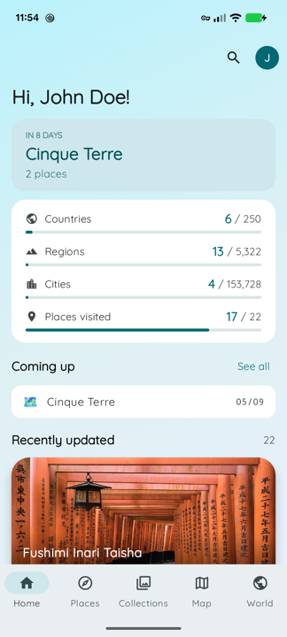
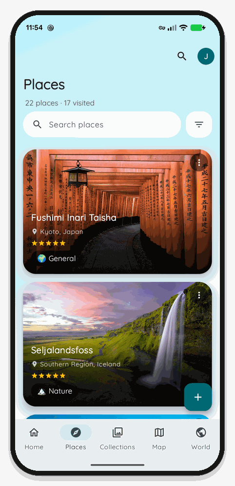
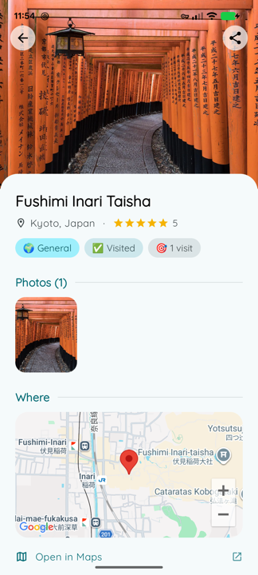
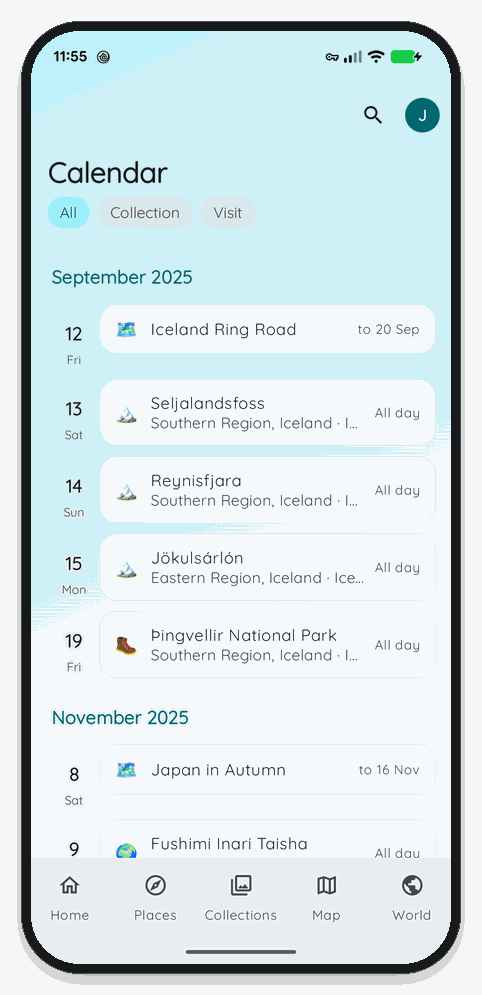
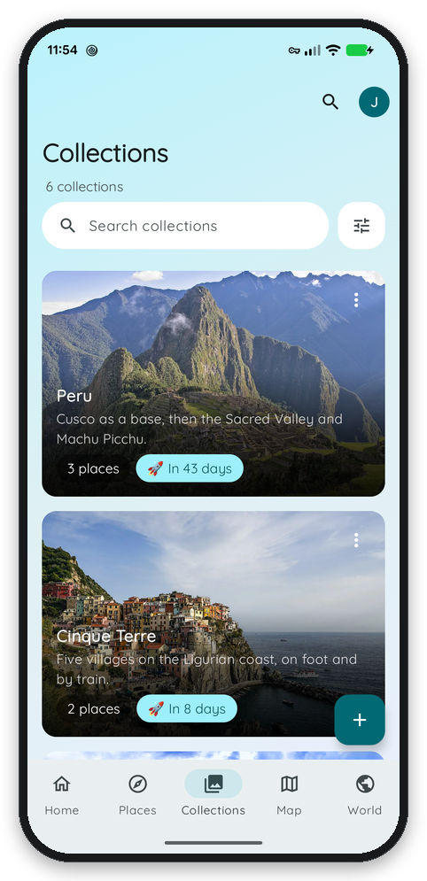
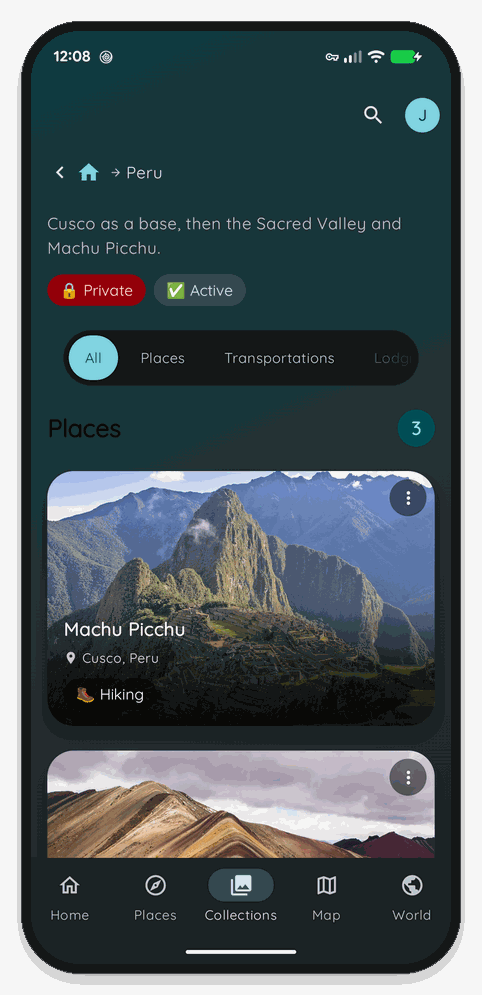
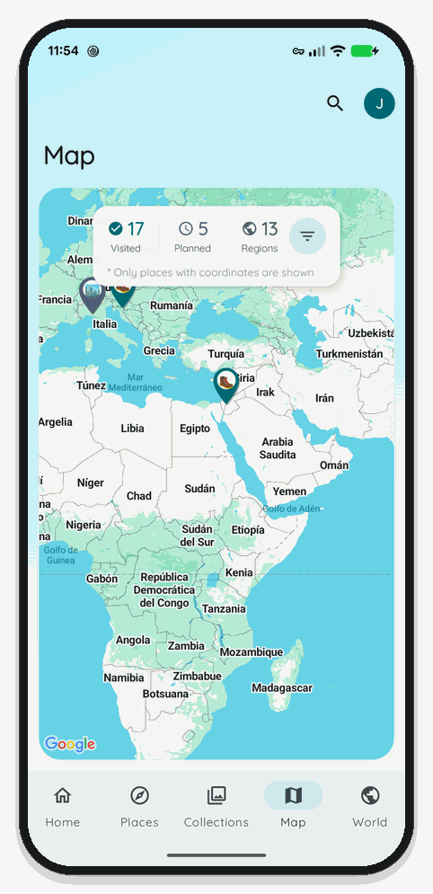
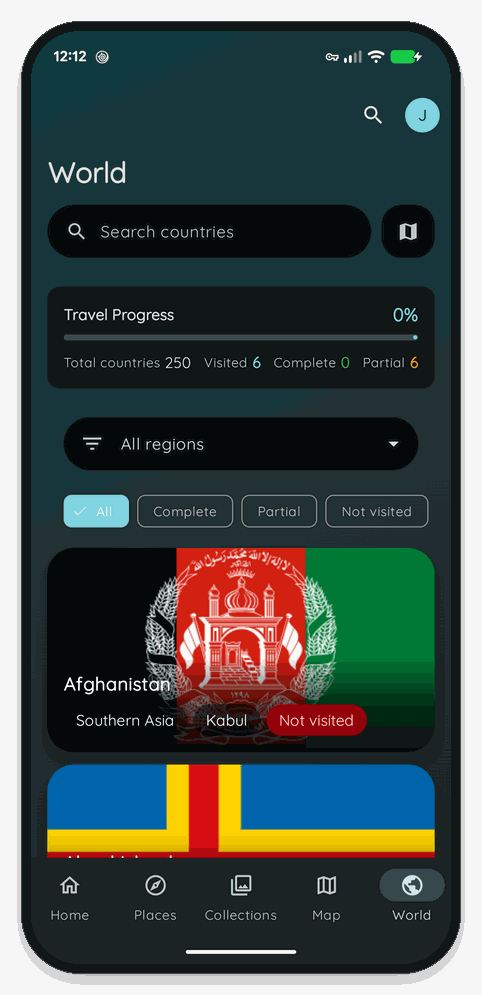

# 🏕️ Adventure Log


> ### 🚧 Under construction
>
> This client is being actively rebuilt against a live AdventureLog server, screen by screen, and
> is **not ready for general use yet**. Expect things to move: screens are being redesigned and
> the wording is still settling.
>
> **Android** is where the work happens and where everything is tested. **iOS** builds and runs -
> sign-in, the dashboard, places, collections and a place's own page all work - but it has had far
> less use, and a few things are Android-only for now (see Known Issues).
>
> Still missing against the web client: downloading the calendar as `.ics`, uploading a profile
> picture, and the parts of Settings that cover MFA, API keys and third-party integrations. There
> is no user directory and none is planned - sharing a collection has its own people picker.
>
> A first release is the goal; there is no date on it.

Adventure Log is a cross-platform travel journal application built with Kotlin Multiplatform and Compose Multiplatform. The app allows users to document their journeys, organize adventures by collections, and explore their memories through rich visual interfaces.

## 🌟 Features

- **Cross-Platform Experience**: Share code between Android & iOS with Kotlin Multiplatform
- **Rich Place Management**: Track places, add photos, and categorize them
- **Collections Organization**: Group and organize places into meaningful collections
- **World Exploration**: Track visited countries, regions, and cities with comprehensive statistics
- **Interactive Map**: Visualize places on an interactive map, clustered and filterable
- **Calendar**: Everything with a date on it, as an agenda you can scroll through and filter
- **Search Everything**: One box for places, collections, cities and countries at once
- **Sharing**: Invite someone with a public profile to a collection, or remove them again
- **Markdown Descriptions**: Descriptions written on the web render as written, not as source
- **Beautiful UI**: Modern Material 3 design with fluid animations and transitions
- **Modular Navigation**: Feature-based navigation system for scalable routing

## 📱 Screenshots

<p align="center">
  
  
  
  
</p>
<p align="center">
  
  
  
  
</p>

<sub>Android, taken on a Pixel 6a. Photos come from Wikimedia Commons through the server's own
image search.</sub>

## 🏗️ Architecture

Adventure Log implements a **Clean Architecture** approach combined with **modular design principles**, creating a codebase that is maintainable, testable, and scalable.

### Core Principles

- **Separation of Concerns**: Each layer has its distinct responsibility
- **Dependency Rule**: Dependencies point inward, with inner layers knowing nothing about outer layers
- **Testability**: Business logic isolated from UI and external frameworks
- **Modularity**: Feature-based modules with clear boundaries

### Module Structure

```
AdventureLog/
├── composeApp/           # Main application entry point
│
├── core/                 # Shared core modules
│   ├── common/           # Common utilities, extensions, base classes
│   ├── data/             # Data layer implementation
│   ├── domain/           # Business logic and use cases
│   ├── model/            # Domain models
│   ├── network/          # Network communication
│   └── permissions/      # Permission handling
│
└── feature/              # Feature modules
    ├── calendar/         # Dated events as a scrollable agenda
    ├── collections/      # Collections management and organization
    ├── detail/           # A place's own page
    ├── home/             # App shell, bottom bar and dashboard
    ├── locations/        # The places list, and adding or editing one
    ├── login/            # Authentication
    ├── map/              # Map visualization
    ├── settings/         # Account and application settings
    ├── ui/               # Shared UI components and utilities
    └── world/            # World exploration features
```

### Clean Architecture Layers

1. **Presentation Layer (UI)**
   - Compose UI components
   - ViewModels with UI State
   - Screen navigation

2. **Domain Layer**
   - Use Cases
   - Domain Models
   - Repository Interfaces

3. **Data Layer**
   - Repository Implementations
   - Remote/Local Data Sources
   - Data Models & Mappers

## 💻 Technology Stack

### Kotlin Multiplatform Mobile

- **Code Sharing Strategy**:
  - **shared**: Business logic, data management, view models
  - **platform-specific**: Native UI elements, platform integrations

### Key Technologies

- **UI Framework**
  - [Compose Multiplatform](https://www.jetbrains.com/lp/compose-multiplatform/): UI toolkit for Android and iOS
  - [Material 3](https://m3.material.io/): Latest Material Design components and theming
  - [Coil](https://coil-kt.github.io/coil/): Image loading library with Compose integration

- **Architecture & Navigation**
  - [Compose Navigation](https://developer.android.com/jetpack/compose/navigation): Jetpack navigation for Compose
  - [Lifecycle Components](https://developer.android.com/jetpack/androidx/releases/lifecycle): ViewModel and lifecycle-aware components

- **Dependency Injection**
  - [Koin](https://insert-koin.io/): Pragmatic lightweight dependency injection for Kotlin

- **Async & Reactive**
  - [Kotlin Coroutines](https://kotlinlang.org/docs/coroutines-overview.html): Asynchronous programming
  - [Kotlin Flow](https://kotlinlang.org/docs/flow.html): Reactive streams built on coroutines

- **Networking**
  - [Ktor](https://ktor.io/): Kotlin multiplatform HTTP client

- **Data Persistence**
  - [Multiplatform Settings](https://github.com/russhwolf/multiplatform-settings): Key-value storage
  - [Kotlinx Serialization](https://github.com/Kotlin/kotlinx.serialization): JSON serialization

## 🧩 Modular Navigation System

Adventure Log implements a sophisticated modular navigation system that:

1. **Centralizes Route Definitions**: Avoiding circular dependencies
2. **Modularizes Feature Navigation**: Each feature manages its own routes
3. **Supports Deep Linking**: Parameter-based navigation between features

The navigation system is organized to provide clear separation between features while maintaining the ability to navigate seamlessly throughout the application.

## 💉 Dependency Injection

The application uses Koin for dependency injection with a modular approach:

- **App Module**: Coordinates the inclusion of all feature modules
- **Feature Modules**: Each feature has its own DI module
- **Core Modules**: Provide shared dependencies across features

This approach promotes modularity while ensuring proper dependency management across the application.

## 🧠 State Management

Adventure Log implements a unidirectional data flow pattern:

1. **UI Events**: Captured by Composables and passed to ViewModels
2. **State Updates**: Processed by ViewModels and exposed as StateFlow
3. **UI Rendering**: Based on current state

The app uses sealed classes to represent different UI states, providing type-safe state management throughout the application.

## 🚀 Getting Started

### Prerequisites

- An Android Studio new enough for AGP 8.13
- JDK 17 (what CI builds with; the compiled bytecode targets Java 11)
- Xcode 26 (for iOS development) - the iOS deployment target is 15.3
- Kotlin 2.2.21

### Setup & Build

#### Android

1. Clone the repository
   ```bash
   git clone https://github.com/DesarrolloAntonio/AdventureLog-Client.git
   cd AdventureLog-Client
   ```

2. Open in Android Studio and sync the project

3. Run the `composeApp` configuration on an Android device or emulator

#### iOS

1. Generate the Kotlin framework
   ```bash
   ./gradlew :composeApp:embedAndSignAppleFrameworkForXcode
   ```

2. Open the Xcode project in the `iosApp` directory
   ```bash
   open iosApp/iosApp.xcodeproj
   ```

3. Build and run on an iOS device or simulator

### Running Tests

```bash
# Run all tests
./gradlew allTests

# Run specific module tests
./gradlew :core:domain:allTests
./gradlew :core:model:allTests
```

## ⚙️ Project Configuration

The project uses a typical KMM setup with Gradle, supporting:

- Android target configuration
- iOS target configuration (arm64, simulatorArm64)
- Shared dependencies in commonMain
- Platform-specific dependencies in respective sourcesets

## 🔍 Advanced Features

### Modular Design Patterns

- **Feature Isolation**: Each feature module works independently
- **API Boundaries**: Clean interfaces between modules
- **Shared Resources**: Common components live in core modules

### Navigation Techniques

- **Deep Linking**: Direct navigation to content via parameters
- **Back Stack Management**: Proper handling of navigation history
- **Nested Navigation**: Complex navigation flows within features

### Code Sharing Strategy

- **90%+ Shared Code**: Most business logic and UI shared across platforms
- **Platform-Specific Adapters**: Native functionality wrapped in platform modules
- **Expect/Actual Pattern**: For platform-specific implementations

## 🔭 What's next

Roughly in the order that makes sense, because several of these unblock each other.

**Offline first.** The app is a thin client today: every screen is a round trip, and with nothing
cached it shows a spinner on a train. Places, collections and the dashboard should persist
locally, the server should become the thing that refreshes them rather than the only source, and
writes made without a connection should queue until there is one.

**Type-safe navigation routes.** Routes are plain strings right now, with serialized JSON passed
inside them. That is fragile on its own terms, and it is also the prerequisite hiding behind two
other items on this list - both Navigation 3 and the SwiftUI shell need routes that are objects
with identity, not strings to be parsed.

**Liquid Glass on iOS.** iOS 26 renders it through native `TabView`, `NavigationStack` and
toolbars, so a Compose app only gets it by handing that chrome to SwiftUI and letting Compose draw
the content inside each screen - the approach JetBrains documents in
[Liquid Glass in Compose Multiplatform](https://kotlinlang.org/docs/multiplatform/ios-liquid-glass.html).
Needs typed routes first, and a decision that the iOS tab bar stops being Compose's.

**Toolchain upgrade.** Compose Multiplatform 1.9.0 first, on its own: it is built against
kotlinx-datetime 0.7.1 and so fixes the iOS date picker outright. Kotlin, AGP 9 and compileSdk 36
come after, as one piece - the Coil, Koin and Ktor updates are all gated behind them.

**iOS parity.** `PlatformBackHandler` does nothing on iOS, which silently disables the
"discard your changes?" prompt and anything else built on it. Related: there is no system back
gesture, because the whole app is a single view controller.

**Adaptive layouts.** `NavigationSuiteScaffold` turns the bottom bar into a navigation rail on
tablets, foldables and landscape. The multiplatform artifact already matches the Compose version
in use. If the SwiftUI shell happens, this becomes the Android and desktop answer only.

**A signed release build.** There is no signing configuration in the project at all, and CI
publishes a debug APK. This is the piece missing between here and a store listing.

**The remaining gaps against the web client.** Downloading the calendar as `.ics`, uploading a
profile picture, and the parts of Settings covering MFA, API keys and third-party integrations.

**Wider tests.** The data layer and the ViewModels have no tests, and while there are Maestro
flows, nothing runs them in CI.

## 🧪 Testing Strategy

- **Unit Tests**:
  - ✅ Model layer: models, mappers and the Markdown parser (20 test files)
  - ✅ Domain layer: use cases (10 test files)
  - ✅ Network layer: DTO mapping and session handling (4 test files)
  - 🚧 Data layer tests (Coming)
  - 🚧 ViewModel tests (Coming)
- **Integration Tests**: Verify interactions between components (Coming)
- **UI Tests**: Test user interfaces and workflows (Coming)

## ⚠️ Known Issues

- **MockK Support**: MockK doesn't support Kotlin/Native targets in Kotlin Multiplatform. Tests use manual fakes instead of mocking libraries for cross-platform compatibility.

- **Date picker on iOS**: Compose Multiplatform 1.8.2 is built against kotlinx-datetime 0.6.0
  while this project uses 0.7.1, which moved `Instant`. Kotlin/Native's partial linkage lets the
  framework link anyway and leaves the missing symbols throwing at runtime, so opening a date
  picker on iOS fails. Android is unaffected. Fixed by moving to Compose Multiplatform 1.9.0,
  which is built against 0.7.1.

- **Back handling on iOS**: `PlatformBackHandler` has no iOS implementation, so anything relying
  on it - such as the "discard your changes?" prompt when leaving a half-filled form - does
  nothing there. The whole app is a single `ComposeUIViewController`, so there is no
  `UINavigationController` to provide a system back gesture either.

## 🛠️ Development Workflow

1. **Feature Development**: New features start in their own modules
2. **Core Enhancements**: Core module changes consider all dependent features
3. **Navigation Updates**: Navigation changes require careful consideration of deep links

## 📚 Resources & Learning

- [Kotlin Multiplatform Official Documentation](https://kotlinlang.org/docs/multiplatform.html)
- [Compose Multiplatform Getting Started](https://www.jetbrains.com/help/kotlin-multiplatform-dev/compose-multiplatform-getting-started.html)
- [Clean Architecture by Robert C. Martin](https://blog.cleancoder.com/uncle-bob/2012/08/13/the-clean-architecture.html)
- [Koin Documentation](https://insert-koin.io/docs/reference/koin-core/start)

## 📄 License

This project is licensed under the MIT License - see the [LICENSE](LICENSE) file for details.

## 👥 Contributors

- [DesarrolloAntonio](https://github.com/DesarrolloAntonio) - Project Lead
- Contributors welcome!

---

<p align="center">Built with ❤️ using Kotlin Multiplatform & Compose</p>
