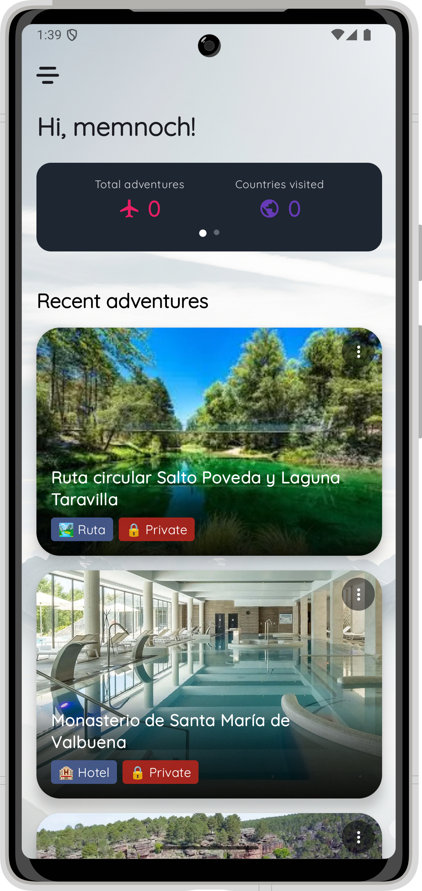

# 🏕️ Adventure Log


Adventure Log is a cross-platform travel journal application built with Kotlin Multiplatform Mobile (KMM) and Compose Multiplatform. The app allows users to document their journeys, organize adventures by collections, and explore their memories through rich visual interfaces.

<p align="center">

</p>

## 🌟 Features

- **Cross-Platform Experience**: Share code between Android & iOS with Kotlin Multiplatform
- **Rich Adventure Management**: Track locations, add notes, photos, and categorize your adventures
- **Beautiful UI**: Modern Material 3 design with fluid animations and transitions
- **Offline Support**: Access your adventures even without network connectivity
- **Dark Mode**: Comfortable viewing experience in all lighting conditions
- **Modular Navigation**: Feature-based navigation system for scalable routing

## 📱 Screenshots

<p align="center">
  
  
  
  
</p>

## 🏗️ Architecture

Adventure Log implements a **Clean Architecture** approach combined with **modular design principles**, creating a codebase that is maintainable, testable, and scalable.

### Architecture Diagram

<p align="center">
  
</p>

### Core Principles

- **Separation of Concerns**: Each layer has its distinct responsibility
- **Dependency Rule**: Dependencies point inward, with inner layers knowing nothing about outer layers
- **Testability**: Business logic isolated from UI and external frameworks
- **Modularity**: Feature-based modules with clear boundaries

### Module Structure

```
AdventureLog/
├── composeApp/           # Main application entry point
│
├── core/                 # Shared core modules
│   ├── common/           # Common utilities, extensions, base classes
│   ├── data/             # Data layer implementation
│   ├── designsystem/     # Design system components and theming
│   ├── domain/           # Business logic and use cases
│   ├── model/            # Domain models
│   ├── network/          # Network communication
│   └── permissions/      # Permission handling
│
└── feature/              # Feature modules
    ├── adventures/       # Adventure listing and management
    ├── detail/           # Adventure details
    ├── home/             # Home screen and dashboard
    ├── login/            # Authentication
    └── settings/         # Application settings
```

### Clean Architecture Layers

1. **Presentation Layer (UI)**
   - Compose UI components
   - ViewModels with UI State
   - Screen navigation

2. **Domain Layer**
   - Use Cases
   - Domain Models
   - Repository Interfaces

3. **Data Layer**
   - Repository Implementations
   - Remote/Local Data Sources
   - Data Models & Mappers

## 💻 Technology Stack

### Kotlin Multiplatform Mobile

<p align="center">
  
</p>

- **Code Sharing Strategy**:
  - **shared**: Business logic, data management, view models
  - **platform-specific**: Native UI elements, platform integrations

### Key Technologies

- **UI Framework**
  - [Compose Multiplatform](https://www.jetbrains.com/lp/compose-multiplatform/): UI toolkit for Android and iOS
  - [Material 3](https://m3.material.io/): Latest Material Design components and theming
  - [Coil](https://coil-kt.github.io/coil/): Image loading library with Compose integration

- **Architecture & Navigation**
  - [Compose Navigation](https://developer.android.com/jetpack/compose/navigation): Jetpack navigation for Compose
  - [Lifecycle Components](https://developer.android.com/jetpack/androidx/releases/lifecycle): ViewModel and lifecycle-aware components

- **Dependency Injection**
  - [Koin](https://insert-koin.io/): Pragmatic lightweight dependency injection for Kotlin

- **Async & Reactive**
  - [Kotlin Coroutines](https://kotlinlang.org/docs/coroutines-overview.html): Asynchronous programming
  - [Kotlin Flow](https://kotlinlang.org/docs/flow.html): Reactive streams built on coroutines

- **Networking**
  - [Ktor](https://ktor.io/): Kotlin multiplatform HTTP client

- **Development Tools**
  - [Compose Hot Reload](https://developer.android.com/jetpack/compose/tooling/hot-reload): Rapid UI development

## 🧩 Modular Navigation System

Adventure Log implements a sophisticated modular navigation system that:

1. **Centralizes Route Definitions**: Avoiding circular dependencies
2. **Modularizes Feature Navigation**: Each feature manages its own routes
3. **Supports Deep Linking**: Parameter-based navigation between features

The navigation system is organized to provide clear separation between features while maintaining the ability to navigate seamlessly throughout the application.

## 💉 Dependency Injection

The application uses Koin for dependency injection with a modular approach:

- **App Module**: Coordinates the inclusion of all feature modules
- **Feature Modules**: Each feature has its own DI module
- **Core Modules**: Provide shared dependencies across features

This approach promotes modularity while ensuring proper dependency management across the application.

## 🧠 State Management

Adventure Log implements a unidirectional data flow pattern:

1. **UI Events**: Captured by Composables and passed to ViewModels
2. **State Updates**: Processed by ViewModels and exposed as StateFlow
3. **UI Rendering**: Based on current state

The app uses sealed classes to represent different UI states, providing type-safe state management throughout the application.

## 🚀 Getting Started

### Prerequisites

- Android Studio Hedgehog or newer
- Xcode 14 or newer (for iOS development)
- JDK 11+
- Kotlin 1.9.0+

### Setup & Build

#### Android

1. Clone the repository
   ```bash
   git clone https://github.com/DesarrolloDroide/AdventureLog.git
   cd AdventureLog
   ```

2. Open in Android Studio and sync the project

3. Run the `composeApp` configuration on an Android device or emulator

#### iOS

1. Generate the Kotlin framework
   ```bash
   ./gradlew :composeApp:embedAndSignAppleFrameworkForXcode
   ```

2. Open the Xcode project in the `iosApp` directory
   ```bash
   open iosApp/iosApp.xcodeproj
   ```

3. Build and run on an iOS device or simulator

## ⚙️ Project Configuration

The project uses a typical KMM setup with Gradle, supporting:

- Android target configuration
- iOS target configuration (arm64, simulatorArm64)
- Shared dependencies in commonMain
- Platform-specific dependencies in respective sourcesets

## 🔍 Advanced Features

### Modular Design Patterns

- **Feature Isolation**: Each feature module works independently
- **API Boundaries**: Clean interfaces between modules
- **Shared Resources**: Common components live in core modules

### Navigation Techniques

- **Deep Linking**: Direct navigation to content via parameters
- **Back Stack Management**: Proper handling of navigation history
- **Nested Navigation**: Complex navigation flows within features

### Code Sharing Strategy

- **90%+ Shared Code**: Most business logic and UI shared across platforms
- **Platform-Specific Adapters**: Native functionality wrapped in platform modules
- **Expect/Actual Pattern**: For platform-specific implementations

## 🧪 Testing Strategy

- **Unit Tests**:Test individual components and business logic (Coming)
- **Integration Tests**: Verify interactions between components (Coming)
- **UI Tests**: Test user interfaces and workflows (Coming)

## 🛠️ Development Workflow

1. **Feature Development**: New features start in their own modules
2. **Core Enhancements**: Core module changes consider all dependent features
3. **Navigation Updates**: Navigation changes require careful consideration of deep links

## 📚 Resources & Learning

- [Kotlin Multiplatform Official Documentation](https://kotlinlang.org/docs/multiplatform.html)
- [Compose Multiplatform Getting Started](https://www.jetbrains.com/help/kotlin-multiplatform-dev/compose-multiplatform-getting-started.html)
- [Clean Architecture by Robert C. Martin](https://blog.cleancoder.com/uncle-bob/2012/08/13/the-clean-architecture.html)
- [Koin Documentation](https://insert-koin.io/docs/reference/koin-core/start)

## 📄 License

This project is licensed under the MIT License - see the [LICENSE](LICENSE) file for details.

## 👥 Contributors

- [DesarrolloDroide](https://github.com/DesarrolloDroide) - Project Lead
- Contributors welcome!

---

<p align="center">Built with ❤️ using Kotlin Multiplatform & Compose</p>
